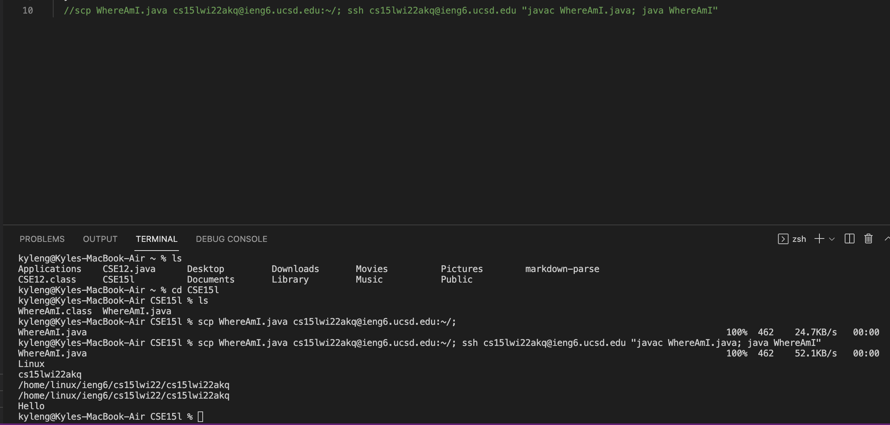

## Installing VScode
* Install VScode through the link [VSCode](https://code.visualstudio.com/)
* You can install any language you would like. In this class I installed Java

## Remotely Connecting

* Find your course-specific account for CSE15L on [AccountInfo](https://sdacs.ucsd.edu/~icc/index.php)
* You may need to reset your password in order to acess the information
* Next open a terminal in VSCode and the following command:   
`ssh cs15lwi22zzz@ieng6.ucsd.edu`
* zzz should be replaced with your account specific info
* Type yes if you get a messsage asking if you want to contiue connecting
* Then enter your password (it is the same one used to access your UCSD account)

Your terminal should look like this:

## Trying Some Commands
Try the following Commands
* `ls` - lists files and directories in the current directory
* `pwd` - prints the path of the current working directory
* `cd` - change to a particular directory
* `ls -a` - same as ls but also lists hidden files
* There are more commands that you can look up online

One example:

* Log out of remote server by running the command `exit`

## Moving Files with scp
* Create a file called `WhereAmI.java` and put any contents you would like inside
* We will then use the following command to move the file to the server:   
`scp WhereAmI.java cs15lwi22zzz@ieng6.ucsd.edu:~/`
* Then enter your password

After you log back into the server using `ssh` this is what you should get:

* You can now use javac and java to run **WhereAmI.java** on the server

## Setting an SSH Key
* You will be creating a public key on the server and a private key on the client to log into the server without a password
* First enter the command `ssh-keygen`
* Type out the exact same file that it shows you
* Leave the passphrase empty by pressing enter again

It should look like this without the Overwrite part:

* Now go back into the remote server using `ssh`
* Then run:
* `mkdir .ssh`
* `logout`
* `scp /Users/kyleng/.ssh/id_rsa.pub cs15lwi22zzz@ieng6.ucsd.edu:~/.ssh/authorized_keys`

The process should look like this:

## Optimizing Remote Running
* There are some technqiues and commands you can use to run a file on a server
* The **Up Arrow** allows you to  run a previoius command you typed
* `ssh cs15lwi22zzz@ieng6.ucsd.edu "javac WhereAmI.java; java WhereAmI"`
* This command allows you to run javac and java on the server without logging in'
* If you don't use quotations only the first command will run on the sever

Example:

