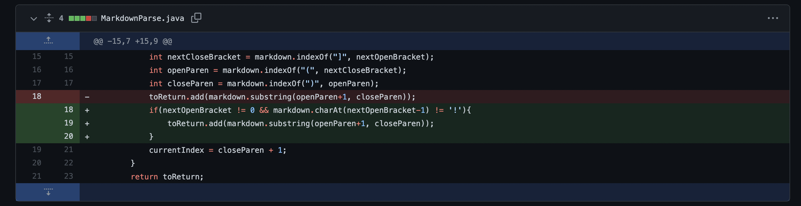
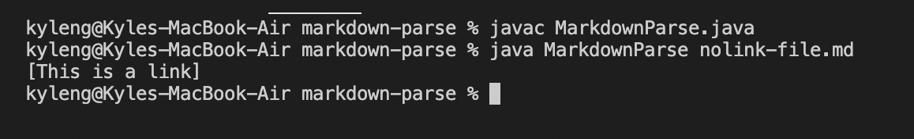

## Code Change 1

Symptom where the the program prints the .png when image is provided in the markdown file

[LinkToTestFile](https://github.com/kyle589/markdown-parse/blob/c6d9f965099038609e2ae3984b2dbca7e24340f1/image-file.md)

The symptom was that when the program was provided a markdown file with an image it printed out the .png when it should only print out links. So the bug in the program was that there was nothing to check an image was provided instead of a link. To fix this, I added an if statement that would check for images.

## Code Change 2

Symptom where the program prints out what is in the brackets even when there is no link

[LinkToTestFile](https://github.com/kyle589/markdown-parse/blob/c6d9f965099038609e2ae3984b2dbca7e24340f1/nolink-file.md)

The symptom was that when the program was provided a markdown file with no link inside the brackets, it printed out whatever was in it. So the bug in the program was that there was nothing to check if what was provided in the brackets was a link or not. There are many different beginnings and endings to links, so in this case I decided to focus on coding that the contents would not print if there were spaces.

## Code Change 3

Symptom where the program runs into an IndexOutofBouonds error when the format [][] instead of .

[LinkToTestFile](https://github.com/kyle589/markdown-parse/blob/c6d9f965099038609e2ae3984b2dbca7e24340f1/bracket-file.md)

The symptom was that when the program was provided with double brackets ([][]), there would be IndexOutOfBounds error. The bug was that if there was no parenthesis, then `nextOpenBracket` would be set to -1, so the array could not add String with a negative index. To fix this, I would break if nextOpenBracket equaled -1 and I also used an if statement to check for parenthesis.