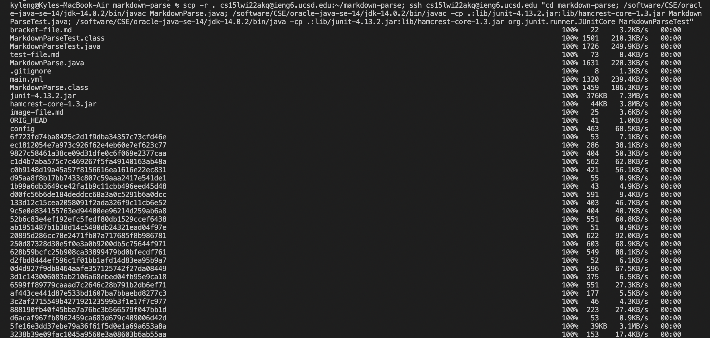

# Copying whole directory with `scp -r`

## Copying whole markdown-parse directory to ieng6 account

Let's say you are in the directory markdown-parse. You can copy the code to the server using the command
`scp -r . cs15lwi22akq@ieng6.ucsd.edu:~ markdown-parse`

## Compiling and running the tests on the server

Now once you log into your account on the server, you can go into the markdown-parse directory using `cd` and then you can compile and run the junit tests.

## Copy and running a directory on a server in one line

code:

`scp -r . cs15lwi22akq@ieng6.ucsd.edu:~/markdown-parse; ssh cs15lwi22akq@ieng6.ucsd.edu "cd markdown-parse; /software/CSE/oracle-java-se-14/jdk-14.0.2/bin/javac MarkdownParse.java; /software/CSE/oracle-java-se-14/jdk-14.0.2/bin/javac -cp .:lib/junit-4.13.2.jar:lib/hamcrest-core-1.3.jar MarkdownParseTest.java; /software/CSE/oracle-java-se-14/jdk-14.0.2/bin/java -cp .:lib/junit-4.13.2.jar:lib/hamcrest-core-1.3.jar org.junit.runner.JUnitCore MarkdownParseTest"`

---

The command is really long because `java` and `javac` had to be repalced with `/software/CSE/oracle-java-se-14/jdk-14.0.2/bin/javac` respectively since some files were compiled on a newer version of java compared to the java runtime on the server.

The basic understanding of this command is to first copy the directory to the server, then log into the server, then go into the markdown-parse directory, and finally compilie and run the junit tests

* 7 keystorkes to command+c and command+v and enter into the terminal.
* 2 keystrokes to uparrow and enter after inputting the command in the terminal

