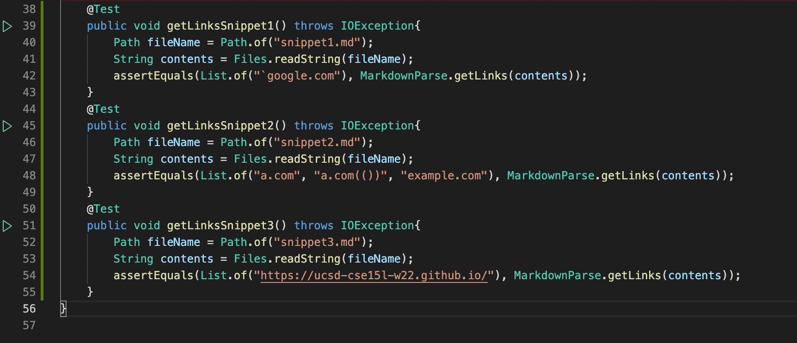
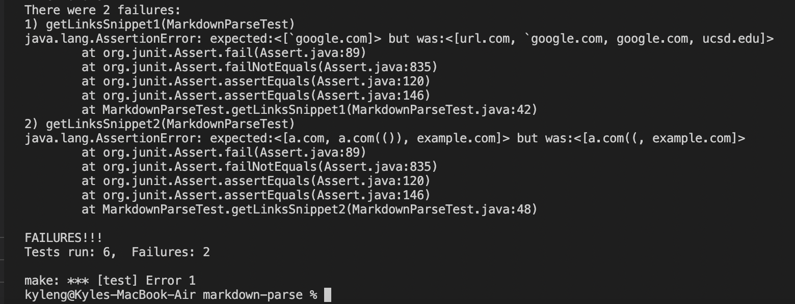
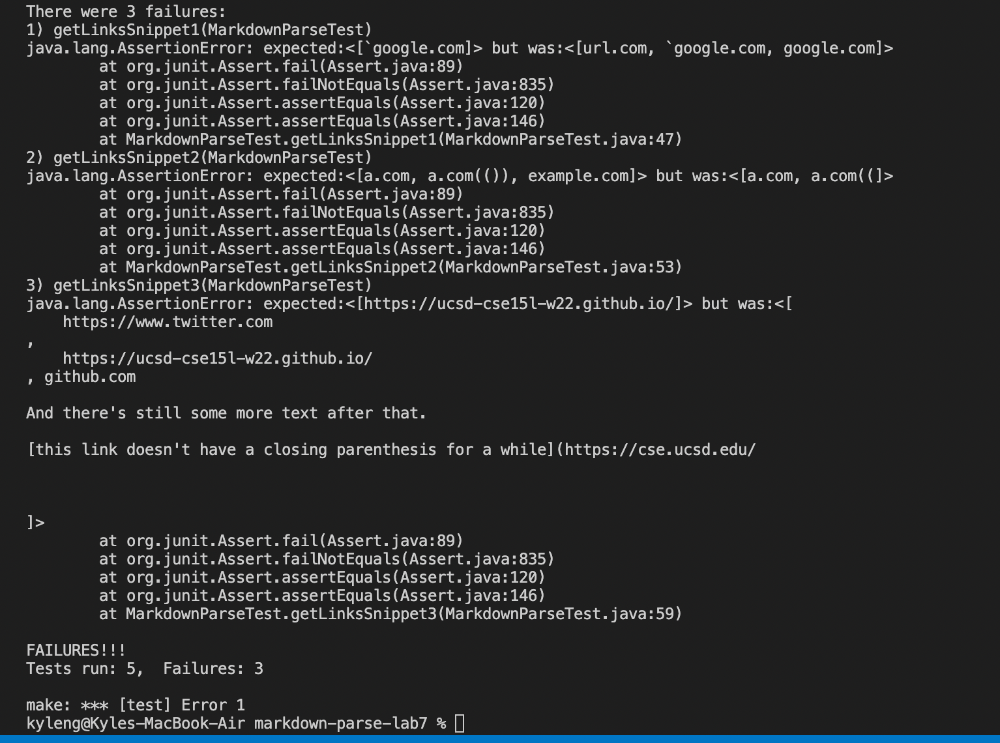
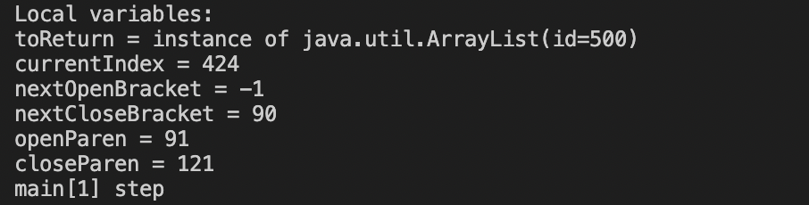

# Repositories
- [My repository](https://github.com/kyle589/markdown-parse)
- [Other group's repository](https://github.com/yi113/markdown-parse)

# Tests for Code Snippets and Expected Output

- There are the test cases I created to test each code snippet

# Output for my Implementation

- I did not include the third test in the picture because it created an infinite loop. But it should print https://ucsd-cse15l-w22.github.io/
- Test 1 did not pass since my code printed out all of the "links" without taking into account backticks
- Test 2 did not pass since it didn't print out a.com and it forgot some parentheses

# Output for Other Group's Implementation

- Test 1 did not pass since it printed out most of the "links" since it didn't account for backticks
- Test 2 did not pass since it forgot some parnthesis and it also didn't print example.com
- Test 3 did not pass since it printed a large portion of the snippet includin the brackets

# Is There a Small Code Change to Make my Program Work?

## Snippet 1
- Yes, I think there is a small code change that can solve the problem with backticks
- You would need to check for backticks inside and outside of the brackets, and if there are then it is not a viable link, so then you skip to the next open bracket.
- Looking at the example, it seems like the backticks around the link is okay, so we don't need to worry about that.

## Snippet 2
- I think it would be more difficult and would probably be a longer code change to fix cases with nested parentheses, brackets, and escaped brackets
- Our code relies on finding the next brackets and parenthesis. So if there are multiple nested brackets and parentheses, it will be difficult to find where the end of the link is
- We will probably need to use loops and if statements to check for multiple brackets or parentheses which may make the code longer.

## Snippet 3
- I used jdb to look for the error in the infinite loop and I found the error here

- I think I would be able to fix this in a short code. I would probably put that if nextOpenBracket = -1 then we exit the loop. Also I would put an if statement that would allow for only one new line between the open parenthesis, the link, and the close parenthsis.