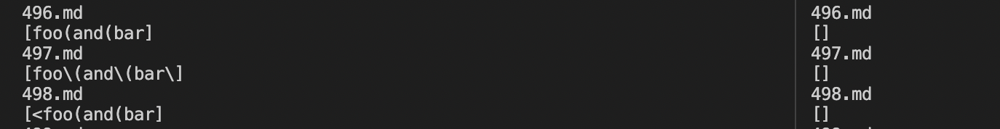
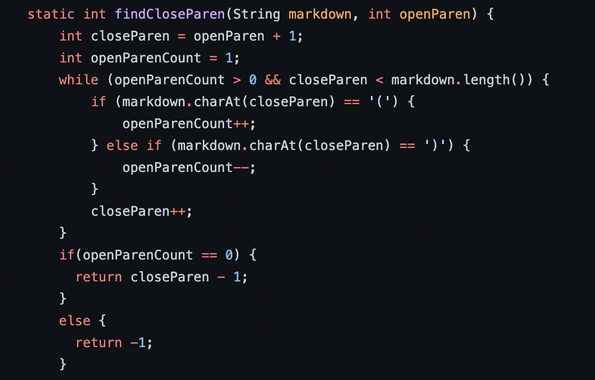
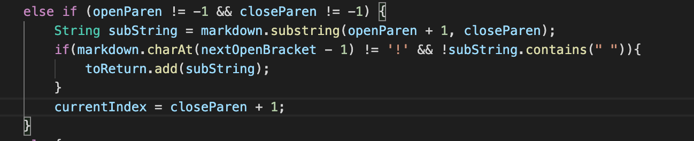

# How I Found Test
- I used bash to run the tests and copied it into a results.txt
- Since some of my own tests caused infinite loops, I decided to compare them manually
- However, it is usually a better idea to use `diff` to compare the two

The left side is my output and the right side is their output:

- For 496.md, the other output was right, while mine was wrong
- For 498.md, my output was correct, while theirs was wrong
# First Test
- I found different outputs for 498.md which contained `[link](<foo(and(bar)>)`
- My implementation was correct because based on commonmark, it should be a link. The reason I think that it is consider a link is because the extra parentheses are within `<>`.
- The other code resulted in `[]` which is wrong. The reason why it printed this, is because the code checks if there is an uneven number of open and closed parentheses within the next open and closed parentheses, then it is not considered a link. The way we would solve this is to look for `<` and `>` and all parentheses inside are not a hinderance to if it is a link or not. We would only need to check the contents between the `(` and `<`. And we would need to check the contents between the `>` and next `)`. If everything here satisfies a link, then the whole thing is a link.

The code fix would go here:

# Second Test
- I found different outputs for 496.md
which contained `[link](foo(and(bar))`

- Their implementation was correct because based on commonmark, it should not be a link

- My code resulted in `[foo(and(bar]`

- The problem with my code is that it can't handle nested parentheses. As long as there is an open and closed parentheses, then it will think everything inside is a link. One way we can solve this is by having a counter to check for the number of open parentheses and closed parenthses within the open and closed parntheses. If the number of open and closed parentheses are unblalanced, then it shouldn't be considered a link, otherwise it should be a link.

The code fix would go here:
